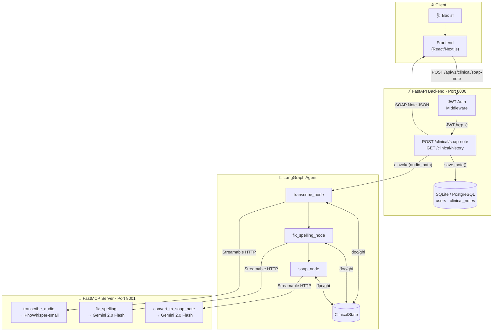
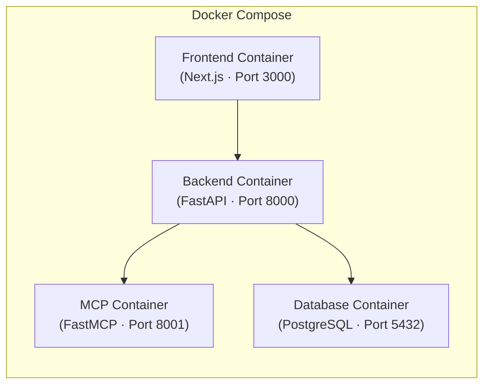

# Architecture Document — AI Clinical Scribe

## System Overview

**AI Clinical Scribe** là hệ thống trợ lý ghi chép y khoa tự động. Khi bác sĩ kết thúc buổi khám, hệ thống nhận file âm thanh cuộc hội thoại, tự động chuyển tiếng nói thành văn bản tiếng Việt, hiệu đính chính tả y khoa, và xuất ra SOAP Note chuẩn y tế — giúp bác sĩ tiết kiệm 15–30 phút ghi chép mỗi ca.

Kiến trúc gồm 2 tiến trình (process) phối hợp qua MCP Protocol:
- **FastAPI Backend (port 8000):** Tiếp nhận request, xác thực JWT, lưu kết quả vào DB.
- **FastMCP Server (port 8001):** Thực thi các tác vụ AI nặng (ASR + LLM) một cách độc lập.

## Architecture Diagram

## Components

### 1. Frontend (React/Next.js)
- **Purpose:** Giao diện upload file âm thanh và hiển thị SOAP Note cho bác sĩ.
- **State Management:** Local state (React hooks).

### 2. Backend (FastAPI)
- **Purpose:** REST API server, xử lý xác thực và điều phối luồng dữ liệu.
- **API Design:** RESTful — prefix `/api/v1`.
- **Authentication:** JWT (Access Token + Refresh Token), mật khẩu mã hóa bằng bcrypt.

### 3. AI Agent (LangGraph)
- **Agent Type:** Sequential Pipeline (không có vòng lặp, không có tool-calling agent).
- **State Schema:** `ClinicalState` — `TypedDict` với 5 trường: `audio_path`, `transcript`, `corrected_transcript`, `soap_note`, `error`.
- **Nodes:** `transcribe_node` → `fix_spelling_node` → `soap_node`.
- **Error Routing:** Conditional edges sau mỗi node — kết thúc ngay nếu có lỗi.
- **Tool Execution:** Không gọi tool trực tiếp mà ủy quyền cho **MCP Server** qua HTTP.

### 4. MCP Server (FastMCP)
- **Purpose:** Đóng gói các tác vụ AI/ML nặng thành microservice độc lập.
- **Tools:** `transcribe_audio` (PhoWhisper), `fix_spelling` (Gemini), `convert_to_soap_note` (Gemini).
- **Transport:** Streamable HTTP (`http://localhost:8001/mcp`).

### 5. Database
- **Type:** SQLite (development) / PostgreSQL (production).
- **Tables:** `users` (tài khoản bác sĩ), `clinical_notes` (lịch sử SOAP note).
- **ORM:** SQLAlchemy v2 với `DeclarativeBase`.

## Data Flow

1. Bác sĩ upload file âm thanh qua Frontend.
2. FastAPI xác thực JWT Bearer Token.
3. `Clinical Service` ghi file vào thư mục temp, gọi `clinical_agent.ainvoke()`.
4. LangGraph `transcribe_node` → MCP `transcribe_audio` → **PhoWhisper** → trả về transcript.
5. LangGraph `fix_spelling_node` → MCP `fix_spelling` → **Gemini** → trả về corrected transcript.
6. LangGraph `soap_node` → MCP `convert_to_soap_note` → **Gemini** → trả về SOAP Note.
7. Kết quả (`transcript`, `corrected_transcript`, `soap_note`) được lưu vào Database.
8. API trả JSON response về Frontend để hiển thị.

## Deployment Architecture

## Security

- API keys lưu trong `.env` — **không commit lên Git**.
- Input validation qua Pydantic v2.
- File upload giới hạn định dạng: `.mp3`, `.wav`, `.m4a`, `.ogg`, `.flac`, `.webm`.
- CORS được cấu hình cho frontend domain.
- File âm thanh tạm thời bị xóa ngay sau khi xử lý xong.

## Design Decisions

| Quyết định | Lựa chọn | Lý do |
|---|---|---|
| **Agent Framework** | LangGraph | Quản lý State rõ ràng, dễ thêm/bớt node, hỗ trợ conditional routing |
| **Tool Execution** | FastMCP (riêng biệt) | Tách process nặng ra khỏi API server, load model một lần, dễ scale |
| **ASR Model** | vinai/PhoWhisper-small | Tối ưu riêng cho tiếng Việt, chạy offline, không tốn API call |
| **LLM** | Google Gemini 2.0 Flash | Chi phí thấp, tốc độ nhanh, chất lượng tốt với tiếng Việt y khoa |
| **Backend** | FastAPI | Async native, tự động sinh Swagger docs, type-safe với Pydantic |
| **Database** | SQLite / PostgreSQL | SQLite cho dev nhanh gọn, PostgreSQL cho production scale |

📄 **Tài liệu chi tiết hơn (với đầy đủ 3 sơ đồ):** [`docs/architecture_diagram.md`](docs/architecture_diagram.md)
