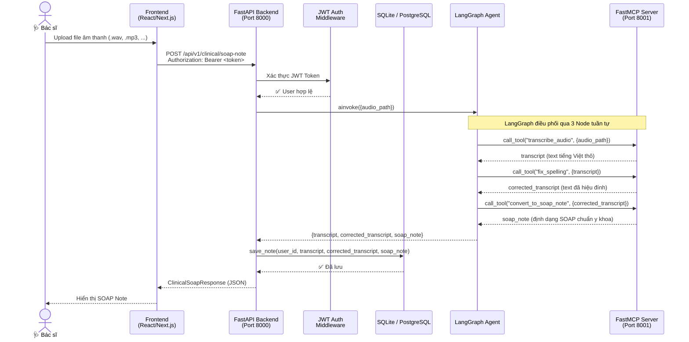
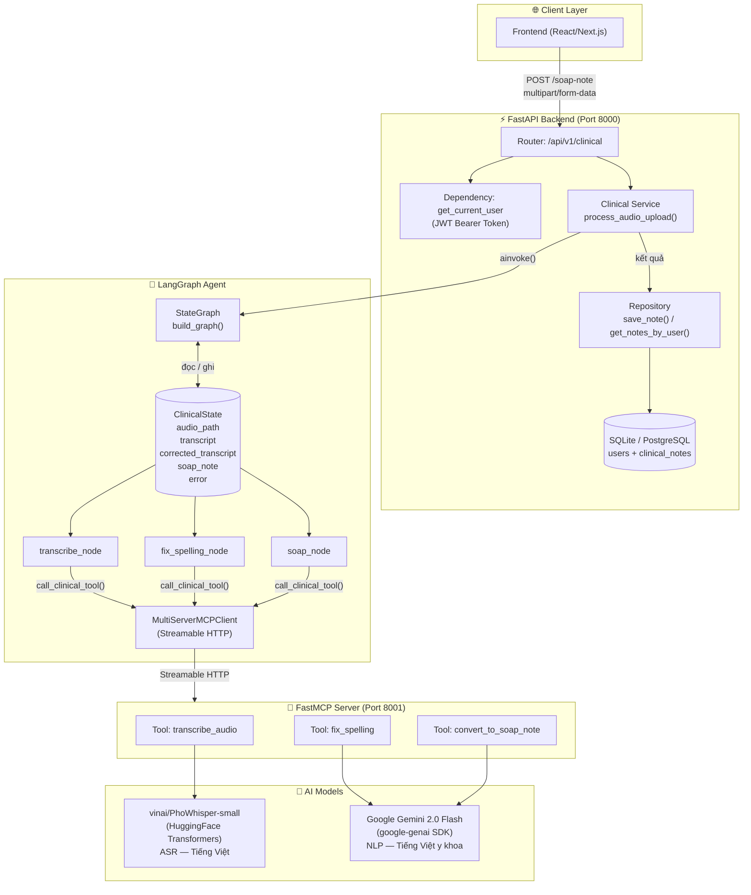
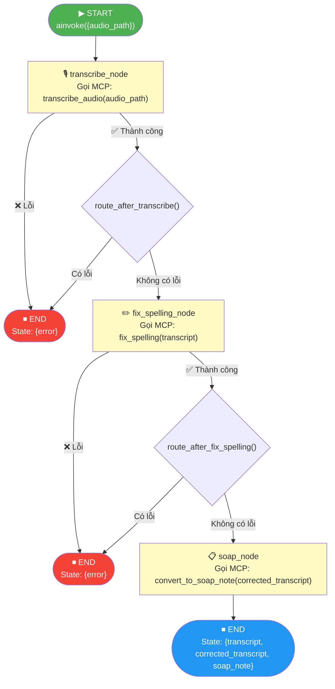

# Architecture Diagram — AI Clinical Scribe

## 1. End-to-End System Flow

Luồng toàn cảnh từ lúc bác sĩ upload file âm thanh đến khi nhận SOAP Note hoàn chỉnh.

---

## 2. LangGraph + MCP Component Architecture

Kiến trúc nội bộ của Agent, thể hiện rõ vai trò từng thành phần.

---

## 3. Agent Data Flow — Biến đổi ClinicalState

Theo dõi cách `ClinicalState` được cập nhật qua từng Node trong LangGraph graph.

---

## 4. Component Details

| Component | Technology | Vai trò |
|---|---|---|
| **Frontend** | React / Next.js | Giao diện người dùng — upload âm thanh, hiển thị SOAP note |
| **Backend** | FastAPI + Uvicorn | API server, xác thực JWT, định tuyến request |
| **Auth** | JWT (python-jose) + bcrypt | Đăng ký / đăng nhập / bảo vệ endpoint |
| **LangGraph Agent** | LangGraph | Điều phối luồng xử lý qua StateGraph |
| **MCP Server** | FastMCP | Đóng gói tools AI thành microservice độc lập |
| **ASR Engine** | `vinai/PhoWhisper-small` | Nhận diện giọng nói tiếng Việt y khoa |
| **LLM** | Google Gemini 2.0 Flash | Hiệu đính chính tả và tạo SOAP Note |
| **Database** | SQLite (dev) / PostgreSQL (prod) | Lưu trữ hồ sơ bệnh nhân và lịch sử SOAP note |
| **ORM** | SQLAlchemy v2 | Quản lý model và session database |

---

## 5. Lý do thiết kế MCP (Design Rationale)

Hệ thống tách biệt **LangGraph Agent** và **FastMCP Server** thành 2 process riêng biệt vì:

- **Tách trách nhiệm rõ ràng:** LangGraph chỉ làm nhiệm vụ *điều phối (orchestration)*, không thực thi logic nặng.
- **Tránh nghẽn cổ chai:** Mô hình `PhoWhisper-small` (~240MB) được load một lần duy nhất khi MCP Server khởi động, không tốn thời gian khởi tạo lại mỗi request.
- **Dễ mở rộng (Scalable):** Có thể scale MCP Server độc lập với Backend nếu lưu lượng tăng cao.
- **Dễ kiểm thử:** Từng Tool trong MCP Server có thể được test độc lập mà không cần chạy cả pipeline.
